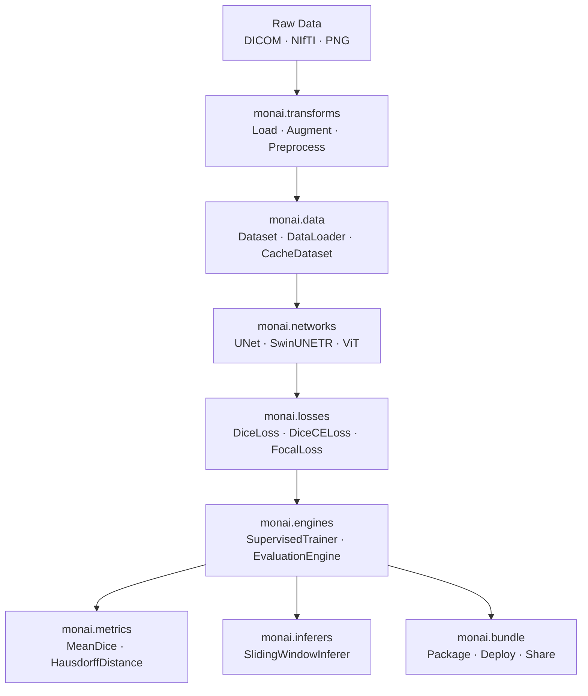

## What is MONAI?

**M**edical **O**pen **N**etwork for **AI** (MONAI) is a [PyTorch](https://pytorch.org/)-based, open-source framework for deep learning in healthcare imaging. It is part of the [PyTorch Ecosystem](https://pytorch.org/ecosystem/) and developed by an open community of academic, industrial, and clinical researchers.

MONAI provides domain-specific components purpose-built for medical imaging workflows: from raw DICOM and NIfTI I/O through to training, evaluation, and deployment. Rather than adapting general-purpose deep learning tools to the medical domain, MONAI is designed from the ground up for the unique challenges of 3D volumetric data, multi-modal imaging, and clinical constraints.

MONAI's core goals are:

- Developing a community of academic, industrial, and clinical researchers collaborating on a common foundation
- Creating state-of-the-art, end-to-end training workflows for healthcare imaging
- Providing researchers with optimized and standardized ways to create and evaluate deep learning models

## Key modules

<CardGroup cols={3}>
  <Card title="transforms" icon="wand-magic-sparkles" href="/concepts/transforms">
    200+ medical-grade image transforms for spatial, intensity, and I/O operations in both array and dictionary-based styles.
  </Card>
  <Card title="data" icon="database" href="/concepts/datasets-and-dataloading">
    Dataset classes (CacheDataset, PersistentDataset, SmartCacheDataset) and DataLoader utilities optimized for large 3D volumes.
  </Card>
  <Card title="networks" icon="network-wired" href="/concepts/networks-and-losses">
    Reference implementations of UNet, SwinUNETR, SegResNet, ViT, DiffusionModelUNet, and 50+ other architectures.
  </Card>
  <Card title="losses" icon="calculator" href="/concepts/networks-and-losses">
    Domain-specific loss functions including DiceLoss, DiceCELoss, FocalLoss, TverskyLoss, and multi-scale variants.
  </Card>
  <Card title="metrics" icon="chart-bar" href="/guides/metrics-and-evaluation">
    Evaluation metrics for segmentation, detection, and classification, including MeanDice, HausdorffDistance, and ROCAUCMetric.
  </Card>
  <Card title="engines" icon="gear" href="/guides/workflows">
    Training and evaluation engines built on PyTorch Ignite, with handlers for logging, checkpointing, and early stopping.
  </Card>
  <Card title="inferers" icon="play" href="/guides/inferers">
    Inference strategies for large volumes, including SlidingWindowInferer, SimpleInferer, and patch-based inference.
  </Card>
  <Card title="bundle" icon="box-archive" href="/guides/bundle">
    A portable model packaging format with JSON/YAML configs for reproducible training, inference, and deployment.
  </Card>
  <Card title="apps" icon="flask" href="/apps/segmentation">
    High-level application helpers including MedNISTDataset, DecathlonDataset, and Auto3DSeg for end-to-end workflows.
  </Card>
</CardGroup>

## Architecture overview

MONAI is structured as a layered toolkit. Modules are composable and each can be used independently or together in a full pipeline.

A typical MONAI workflow proceeds through these stages:

1. **Data loading** — `monai.transforms` reads medical image formats (NIfTI, DICOM, PNG) via `LoadImaged` and converts them to `MetaTensor` objects that carry spatial metadata alongside pixel data.
2. **Preprocessing** — Compose chains of transforms for intensity normalization, resampling, cropping, and augmentation.
3. **Dataset and DataLoader** — `monai.data` provides `CacheDataset` and `PersistentDataset` for efficient repeated access to preprocessed volumes.
4. **Model** — `monai.networks` supplies architecture implementations. `monai.losses` provides task-appropriate loss functions.
5. **Training** — `monai.engines` wraps the training loop with handlers for checkpointing, logging, and validation.
6. **Inference** — `monai.inferers.SlidingWindowInferer` handles inference on volumes larger than the training patch size.
7. **Evaluation** — `monai.metrics` computes segmentation and classification metrics in a distributed-training-aware manner.

## Requirements

| Requirement | Version |
| --- | --- |
| Python | >= 3.9 (3.9, 3.10, 3.11 supported) |
| PyTorch | >= 2.4.1 |
| NumPy | >= 1.24, < 3.0 |

MONAI's core modules require only PyTorch and NumPy. Optional dependencies extend support for additional file formats and workflow integrations. See [Installation](/installation) for details.

## License and links

MONAI is released under the [Apache License 2.0](https://opensource.org/licenses/Apache-2.0).

<CardGroup cols={2}>
  <Card title="GitHub repository" icon="github" href="https://github.com/Project-MONAI/MONAI">
    Source code, issue tracker, and contribution guidelines.
  </Card>
  <Card title="PyPI package" icon="box" href="https://pypi.org/project/monai/">
    Published releases and package metadata on the Python Package Index.
  </Card>
  <Card title="Model Zoo" icon="warehouse" href="https://github.com/Project-MONAI/model-zoo">
    Community-contributed pre-trained models in MONAI Bundle format.
  </Card>
  <Card title="Tutorials" icon="graduation-cap" href="https://github.com/Project-MONAI/tutorials">
    Jupyter notebooks covering classification, segmentation, detection, and generation.
  </Card>
</CardGroup>
